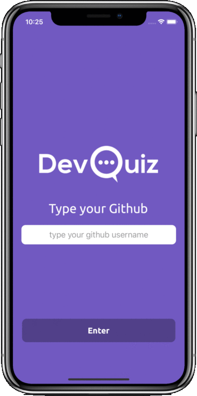

<h1 align="center">
    
</h1>

<h4 align="center">
  A simple real time quiz game
</h4>

  

  
  
  

  

  

 

  

## Technologies

This project was built using:

- [React Native](https://facebook.github.io/react-native/)
- [SocketIO](https://socket.io/)
- [Lottie](https://airbnb.design/lottie/)
- [One Signal](https://onesignal.com/)
- [React Native Vector Icons](https://github.com/oblador/react-native-vector-icons)
- [Styled Components](https://styled-components.com/)
- [React Navigation](https://reactnavigation.org/)
- and more...

## Project

DevQuiz is a question and answer game for developers, where only using the Github user you can enter and invite your friends to play and have fun.

## Contributors

<table>
  <tr>
    <td align="center"><a href="https://github.com/erickcouto"> <b>Erick Alves</b></a> <a href="https://www.linkedin.com/in/erick-alves-do-couto-8b1114a/" title="Linkedin">Linkedin</a></td>
    <td align="center"><a href="https://github.com/ricardovcorrea"> <b>Ricardo Vaz</b></a> <a href="https://www.linkedin.com/in/ricardo-vaz-correa/" title="Linkedin">Linkedin</a></td>
    <td align="center"><a href="https://github.com/dankobaia"> <b>Daniel Porto</b></a> <a href="https://www.linkedin.com/in/daniel-porto/" title="Linkedin">Linkedin</a></td>
    
  </tr>
</table>
